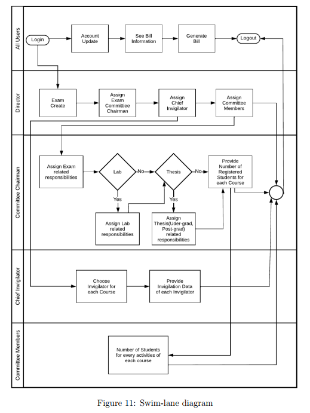
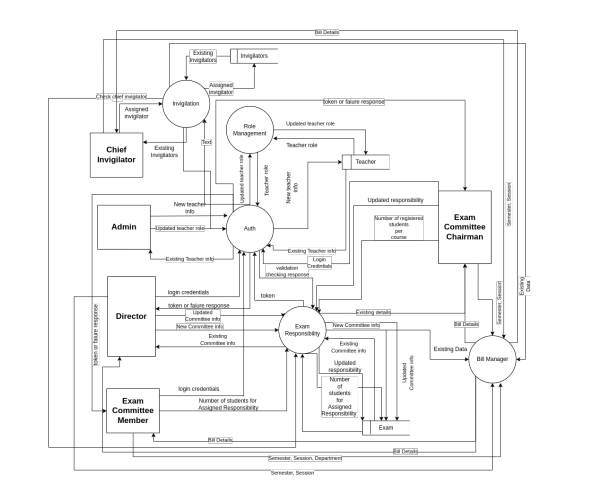
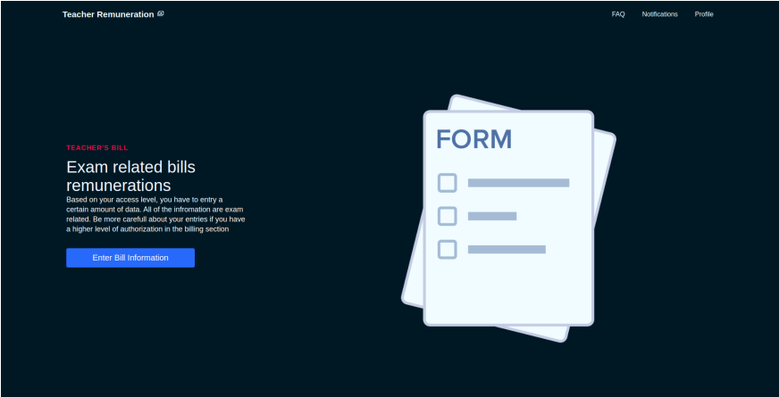
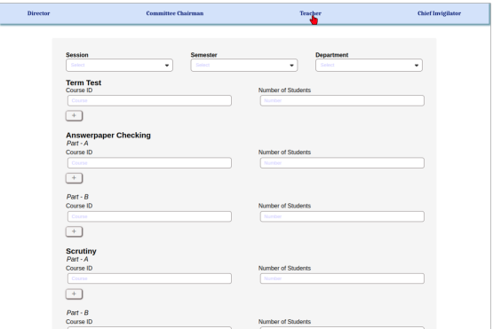
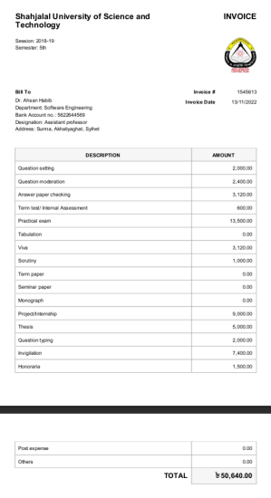

# Teacher Staff Remuneration System

## Overview

The Teacher Staff Remuneration System automates the manual process of remunerating teachers at Shahjalal University of Science and Technology, replacing inefficient handwritten ledgers. It digitizes the entire workflow, from forming exam committees to generating payment invoices, improving accuracy, transparency, and efficiency. 

The system uses a __normalized__ database architecture to optimize data storage and retrieval, ensuring consistency. Role-based access is implemented to provide appropriate permissions to administrators, directors, chairpersons, and teachers, enhancing both security and organization.

## Scope

The Teacher Staff Remuneration System is intended for use by the Exam Controller's Office and IICT office at Shahjalal University of Science and Technology, but it can be adapted for any public university. The system covers the following main functions:

- **Exam Committee Management**: Facilitates the creation and management of exam committees, assigning roles and responsibilities to faculty members.
- **Remuneration Automation**: Automatically generates remuneration bills based on assigned tasks, ensuring accurate and timely payments.
- **Role-Based Access Control**: Ensures secure and organized management of user roles, with specific permissions for Administrators, Directors, Chairpersons, and Teachers.
- **User-Friendly Interface**: The system is designed with accessibility in mind, offering a clean and intuitive user experience for all users, including those with disabilities.

## Tech Stack

- **Frontend**: React, React Query, Axios, React Router DOM
- **Backend**: C#, .NET, Entity Framework
- **Database**: MySQL

## Database Architecture
**Process Flow Diagram**

**DFD Level - 2**

## Screenshots

**Home Page**

**Part of Exam committee member form**

**Final bill**

